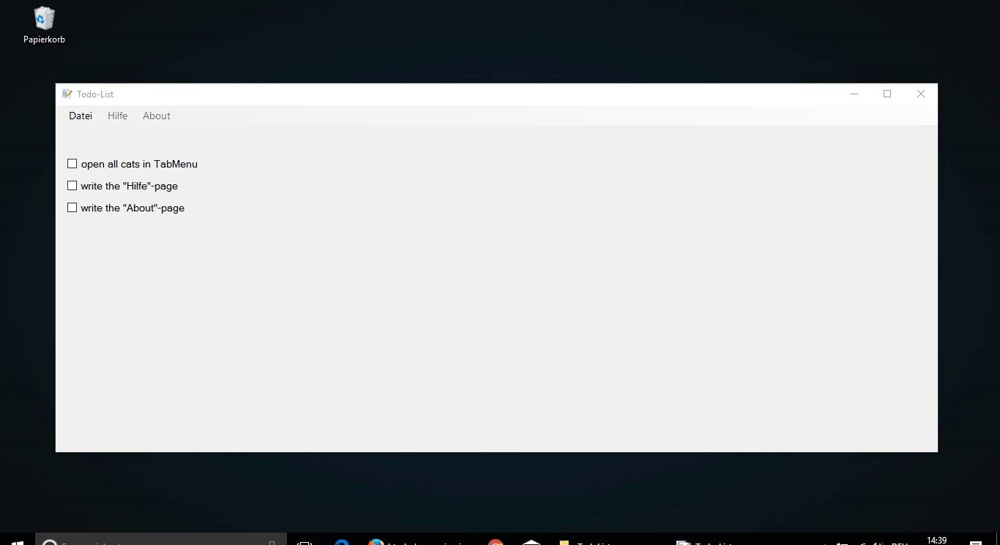
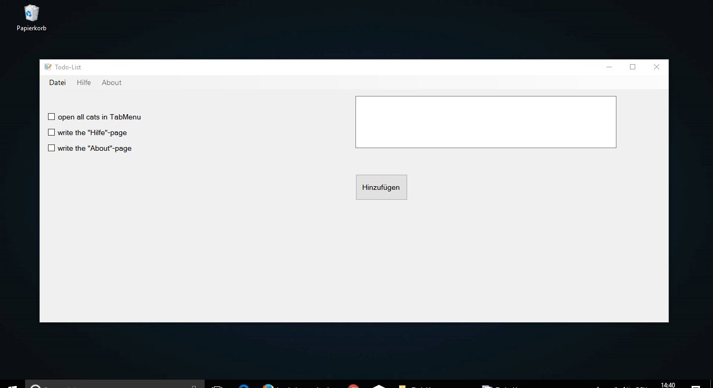
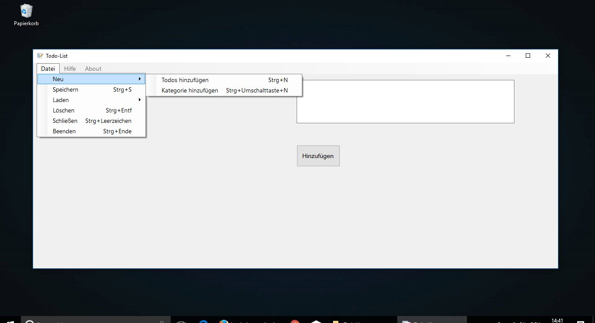

### Developer
The current developer and owner is: Florian Dahlitz

### Note
1. You have to change the ```String^ fullPath``` variable in MyForm.h line 64 (path to folder in which the category-files are created in)
2. Make sure that the folder "categories" exists
3. Compile and have fun

### Currently not available
1. Open and editing of all existing categories
2. "Hilfe"-page (help-page)
3. "About"-page

### Screenshots
</img>
</img>
</img>
